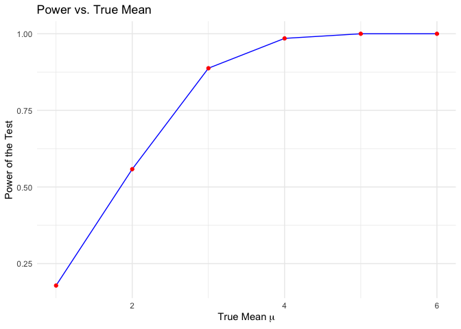
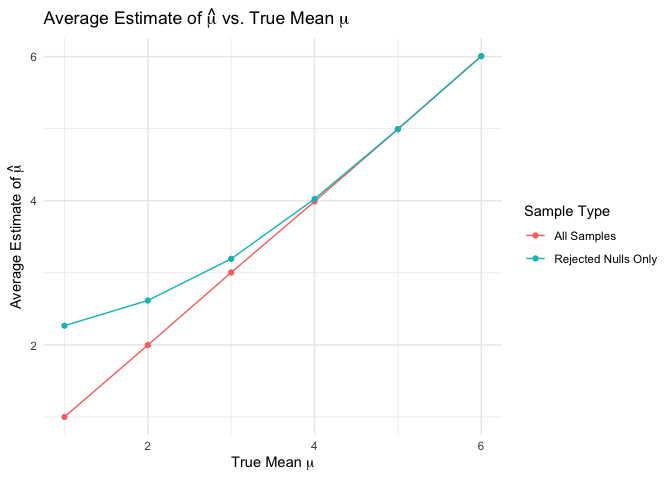

p8105_hw5_zl3544
================
2024-11-16

``` r
# Load Required Packages
library(tidyverse)
library(broom)
library(knitr)
library(ggplot2)
```

# Problem 1

``` r
check_duplicate_birthday <- function(group_size) {
  birthdays <- sample(1:365, group_size, replace = TRUE)
  return(any(duplicated(birthdays)))
}

simulate_probabilities <- function(group_sizes, num_simulations = 10000) {
  probabilities <- sapply(group_sizes, function(n) {
    duplicates <- sum(replicate(num_simulations, check_duplicate_birthday(n)))
    return(duplicates / num_simulations)
  })
  return(probabilities)
}

group_sizes <- 2:50
probabilities <- simulate_probabilities(group_sizes)

plot(
  group_sizes, probabilities, type = "p", pch = 1, col = "blue",
  xlab = "Group Size", ylab = "Probability",
  main = "Probability of At Least Two People In The Group Sharing a Birthday"
)
grid()
```

<!-- -->

From the plot, we know that as the group size increases, the probability
of sharing birthday increases too.

# Problem 2

``` r
# Function to Simulate Mean and P-value
simulate_mean_pvalue <- function(sample_size, true_mean = 0, std_dev = 5) {
  sample_data <- rnorm(sample_size, mean = true_mean, sd = std_dev)
  t_test <- t.test(sample_data, mu = 0)
  result <- tibble(
    estimated_mean = mean(sample_data),
    p_value = t_test$p.value
  )
  return(result)
}

set.seed(1)
true_means <- 1:6
simulation_results <- map_dfr(true_means, function(mu) {
  replicate(5000, simulate_mean_pvalue(30, true_mean = mu), simplify = FALSE) %>%
    bind_rows() %>%
    mutate(true_mean = mu)
})

# Calculate power for each true mean
power_results <- simulation_results %>%
  group_by(true_mean) %>%
  summarize(power = mean(p_value < 0.05))

# Calculate average estimates
average_estimates <- simulation_results %>%
  group_by(true_mean) %>%
  summarize(
    avg_estimate_all = mean(estimated_mean),
    avg_estimate_rejected = mean(estimated_mean[p_value < 0.05])
  )

ggplot(power_results, aes(x = true_mean, y = power)) +
  geom_line(color = "blue") +
  geom_point(color = "red") +
  labs(
    x = expression("True Mean " * mu),
    y = "Power of the Test",
    title = "Power vs. True Mean"
  ) +
  theme_minimal()
```

<!-- -->

The power of a one-sample t-test increases when effect sizes increases,
the power of the test increases when the true mean increases.

``` r
# Combine average estimates for plotting
plot_data <- average_estimates %>%
  pivot_longer(
    cols = starts_with("avg_estimate"),
    names_to = "sample_type",
    values_to = "average_estimate"
  ) %>%
  mutate(sample_type = recode(sample_type,
    avg_estimate_all = "All Samples",
    avg_estimate_rejected = "Rejected Nulls Only"
  ))

ggplot(plot_data, aes(x = true_mean, y = average_estimate, color = sample_type)) +
  geom_line() +
  geom_point() +
  labs(
    x = expression("True Mean " * mu),
    y = expression("Average Estimate of " * hat(mu)),
    title = expression("Average Estimate of " * hat(mu) * " vs. True Mean " * mu),
    color = "Sample Type"
  ) +
  theme_minimal()
```

<!-- -->

The average estimate of $\hat{\mu}$ across all samples closely matches
the true mean. However, when considering only samples where the null
hypothesis was rejected, the average estimate tends to be higher than
the true mean, especially for smaller true mean values. This occurs due
to selection bias, as only samples with larger deviations from the null
are included.

# Problem 3

``` r
# Read the data from the GitHub repository
homicide_data <- read_csv("https://raw.githubusercontent.com/washingtonpost/data-homicides/master/homicide-data.csv")
```

    ## Rows: 52179 Columns: 12
    ## ── Column specification ────────────────────────────────────────────────────────
    ## Delimiter: ","
    ## chr (9): uid, victim_last, victim_first, victim_race, victim_age, victim_sex...
    ## dbl (3): reported_date, lat, lon
    ## 
    ## ℹ Use `spec()` to retrieve the full column specification for this data.
    ## ℹ Specify the column types or set `show_col_types = FALSE` to quiet this message.

``` r
homicide_data <- homicide_data %>%
  mutate(city_state = paste(city, state, sep = ", "))

unsolved_dispositions <- c("Closed without arrest", "Open/No arrest")

# Summarize homicides by city
city_summary <- homicide_data %>%
  group_by(city_state) %>%
  summarize(
    total_homicides = n(),
    unsolved_homicides = sum(disposition %in% unsolved_dispositions),
    .groups = 'drop'
  )

city_summary %>%
  kable(
    col.names = c("City, State", "Total Homicides", "Unsolved Homicides"),
    caption = "Summary of Homicides by City"
  )
```

| City, State        | Total Homicides | Unsolved Homicides |
|:-------------------|----------------:|-------------------:|
| Albuquerque, NM    |             378 |                146 |
| Atlanta, GA        |             973 |                373 |
| Baltimore, MD      |            2827 |               1825 |
| Baton Rouge, LA    |             424 |                196 |
| Birmingham, AL     |             800 |                347 |
| Boston, MA         |             614 |                310 |
| Buffalo, NY        |             521 |                319 |
| Charlotte, NC      |             687 |                206 |
| Chicago, IL        |            5535 |               4073 |
| Cincinnati, OH     |             694 |                309 |
| Columbus, OH       |            1084 |                575 |
| Dallas, TX         |            1567 |                754 |
| Denver, CO         |             312 |                169 |
| Detroit, MI        |            2519 |               1482 |
| Durham, NC         |             276 |                101 |
| Fort Worth, TX     |             549 |                255 |
| Fresno, CA         |             487 |                169 |
| Houston, TX        |            2942 |               1493 |
| Indianapolis, IN   |            1322 |                594 |
| Jacksonville, FL   |            1168 |                597 |
| Kansas City, MO    |            1190 |                486 |
| Las Vegas, NV      |            1381 |                572 |
| Long Beach, CA     |             378 |                156 |
| Los Angeles, CA    |            2257 |               1106 |
| Louisville, KY     |             576 |                261 |
| Memphis, TN        |            1514 |                483 |
| Miami, FL          |             744 |                450 |
| Milwaukee, wI      |            1115 |                403 |
| Minneapolis, MN    |             366 |                187 |
| Nashville, TN      |             767 |                278 |
| New Orleans, LA    |            1434 |                930 |
| New York, NY       |             627 |                243 |
| Oakland, CA        |             947 |                508 |
| Oklahoma City, OK  |             672 |                326 |
| Omaha, NE          |             409 |                169 |
| Philadelphia, PA   |            3037 |               1360 |
| Phoenix, AZ        |             914 |                504 |
| Pittsburgh, PA     |             631 |                337 |
| Richmond, VA       |             429 |                113 |
| Sacramento, CA     |             376 |                139 |
| San Antonio, TX    |             833 |                357 |
| San Bernardino, CA |             275 |                170 |
| San Diego, CA      |             461 |                175 |
| San Francisco, CA  |             663 |                336 |
| Savannah, GA       |             246 |                115 |
| St. Louis, MO      |            1677 |                905 |
| Stockton, CA       |             444 |                266 |
| Tampa, FL          |             208 |                 95 |
| Tulsa, AL          |               1 |                  0 |
| Tulsa, OK          |             583 |                193 |
| Washington, DC     |            1345 |                589 |

Summary of Homicides by City

``` r
# Proportion Test for Baltimore, MD
baltimore_data <- homicide_data %>%
  filter(city_state == "Baltimore, MD")

total_cases <- nrow(baltimore_data)
unsolved_cases <- sum(baltimore_data$disposition %in% unsolved_dispositions)

prop_test_baltimore <- prop.test(unsolved_cases, total_cases) %>%
  broom::tidy()

estimated_proportion <- prop_test_baltimore$estimate
conf_low <- prop_test_baltimore$conf.low
conf_high <- prop_test_baltimore$conf.high

tibble(
  Estimated_Proportion = estimated_proportion,
  Confidence_Interval_Low = conf_low,
  Confidence_Interval_High = conf_high
)
```

    ## # A tibble: 1 × 3
    ##   Estimated_Proportion Confidence_Interval_Low Confidence_Interval_High
    ##                  <dbl>                   <dbl>                    <dbl>
    ## 1                0.646                   0.628                    0.663
