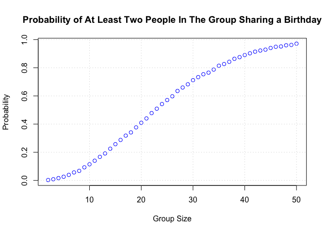

p8105_hw5_zl3544
================
2024-11-16

``` r
# Load Required Packages
library(tidyverse)
library(broom)
library(knitr)
library(ggplot2)
```

# Problem 1

``` r
check_duplicate_birthday <- function(group_size) {
  birthdays <- sample(1:365, group_size, replace = TRUE)
  return(any(duplicated(birthdays)))
}

simulate_probabilities <- function(group_sizes, num_simulations = 10000) {
  probabilities <- sapply(group_sizes, function(n) {
    duplicates <- sum(replicate(num_simulations, check_duplicate_birthday(n)))
    return(duplicates / num_simulations)
  })
  return(probabilities)
}

group_sizes <- 2:50
probabilities <- simulate_probabilities(group_sizes)

plot(
  group_sizes, probabilities, type = "p", pch = 1, col = "blue",
  xlab = "Group Size", ylab = "Probability",
  main = "Probability of At Least Two People In The Group Sharing a Birthday"
)
grid()
```

<!-- -->

From the plot, we know that as the group size increases, the probability
of sharing birthday increases too.

# Problem 2

``` r
# Function to Simulate Mean and P-value
simulate_mean_pvalue <- function(sample_size, true_mean = 0, std_dev = 5) {
  sample_data <- rnorm(sample_size, mean = true_mean, sd = std_dev)
  t_test <- t.test(sample_data, mu = 0)
  result <- tibble(
    estimated_mean = mean(sample_data),
    p_value = t_test$p.value
  )
  return(result)
}

set.seed(1)
true_means <- 0:6
simulation_results <- map_dfr(true_means, function(mu) {
  replicate(5000, simulate_mean_pvalue(30, true_mean = mu), simplify = FALSE) %>%
    bind_rows() %>%
    mutate(true_mean = mu)
})

# Calculate power for each true mean
power_results <- simulation_results %>%
  group_by(true_mean) %>%
  summarize(power = mean(p_value < 0.05))

# Calculate average estimates
average_estimates <- simulation_results %>%
  group_by(true_mean) %>%
  summarize(
    avg_estimate_all = mean(estimated_mean),
    avg_estimate_rejected = mean(estimated_mean[p_value < 0.05])
  )
```
